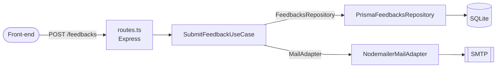

<h1 align="center">💬 Feedget · API</h1>

<p align="center">
  API REST do <strong>Feedget</strong>, um widget de feedback que permite ao usuário reportar bugs, ideias e sugestões com captura de tela.<br/>
  Os feedbacks são persistidos no banco e a equipe é notificada por e-mail.
</p>

<p align="center">
  
  
  
  
  
</p>

<p align="center">
  <a href="https://feedget-davidealmeida.vercel.app"><strong>🔗 Ver demo ao vivo</strong></a> ·
  <a href="https://nlw-return-impulse-server.onrender.com/health"><strong>🩺 Status da API</strong></a>
</p>

<p align="center">
  <a href="#-sobre">Sobre</a> •
  <a href="#-arquitetura">Arquitetura</a> •
  <a href="#-tecnologias">Tecnologias</a> •
  <a href="#-endpoints">Endpoints</a> •
  <a href="#-como-rodar">Como rodar</a> •
  <a href="#-testes">Testes</a> •
  <a href="#-deploy">Deploy</a>
</p>

---

## 📌 Sobre

Este repositório é o **back-end** do Feedget. O front-end (React + Tailwind) está em
👉 **[nlw-return-impulse-web](https://github.com/DaviDeAlmeida/nlw-return-impulse-web)**.

**O que a API faz:**

- Recebe feedbacks dos tipos `BUG`, `IDEA` e `OTHER`, com comentário e screenshot opcional (base64)
- Valida os dados na camada de caso de uso, antes de qualquer efeito colateral
- Persiste o feedback em banco via **Prisma ORM**
- Envia um e-mail HTML para a equipe com o conteúdo e a imagem anexada (com escape de HTML)
- Se o e-mail falhar ou não estiver configurado, o feedback é salvo do mesmo jeito

Projeto desenvolvido durante o **NLW Return (trilha Impulse)** da Rocketseat e evoluído depois com configuração via variáveis de ambiente, health check, tratamento de erros e scripts de build para produção.

## 🏛 Arquitetura

A aplicação segue princípios de **SOLID** e **Clean Architecture**: a regra de negócio (caso de uso) não conhece Express, Prisma nem Nodemailer. Ela depende só de **interfaces** (contratos), e as implementações concretas são injetadas.



```
src/
├── adapters/              # Contratos de serviços externos
│   ├── mail-adapter.ts
│   └── nodemailer/        # Implementação com Nodemailer
├── repositories/          # Contratos de acesso a dados
│   ├── feedbacks-repository.ts
│   └── prisma/            # Implementação com Prisma
├── use-cases/             # Regras de negócio + testes unitários
│   ├── submit-feedback-use-case.ts
│   └── submit-feedback-use-case.spec.ts
├── routes.ts              # Camada HTTP
└── server.ts              # Bootstrap da aplicação
```

**Por que isso importa:** os testes unitários usam *spies* no lugar do banco e do e-mail, então rodam em milissegundos e sem infraestrutura. Trocar o SQLite por PostgreSQL ou o Nodemailer por outro provedor (SES, Resend etc.) exige só uma nova implementação da interface, sem tocar na regra de negócio.

## 🚀 Tecnologias

| Camada | Tecnologia |
| --- | --- |
| Runtime | [Node.js](https://nodejs.org/) + [TypeScript](https://www.typescriptlang.org/) |
| HTTP | [Express](https://expressjs.com/) + [CORS](https://github.com/expressjs/cors) |
| Banco de dados | [Prisma ORM](https://www.prisma.io/) + SQLite |
| E-mail | [Nodemailer](https://nodemailer.com/) ([Mailtrap](https://mailtrap.io/) em desenvolvimento) |
| Testes | [Jest](https://jestjs.io/) + [SWC](https://swc.rs/) |
| Dev | [ts-node-dev](https://github.com/wclr/ts-node-dev) (hot reload) |

## 📡 Endpoints

### `GET /health`

Health check, útil para monitoramento e plataformas de deploy.

```json
{ "status": "ok" }
```

### `POST /feedbacks`

Cria um novo feedback e notifica a equipe por e-mail.

```http
POST /feedbacks
Content-Type: application/json

{
  "type": "BUG",
  "comment": "O botão de enviar não funciona no Safari",
  "screenshot": "data:image/png;base64,iVBORw0KGgo..."
}
```

| Campo | Tipo | Obrigatório | Descrição |
| --- | --- | :---: | --- |
| `type` | `string` | ✅ | `BUG`, `IDEA` ou `OTHER` |
| `comment` | `string` | ✅ | Texto do feedback |
| `screenshot` | `string` | ❌ | Imagem PNG em base64 (`data:image/png;base64,...`) |

| Status | Quando |
| --- | --- |
| `201 Created` | Feedback salvo (e e-mail enviado, se o SMTP estiver configurado) |
| `400 Bad Request` | Dados inválidos, ex.: `{ "error": "Comment is required" }` |

## 💻 Como rodar

### Pré-requisitos

- [Node.js](https://nodejs.org/) 18 ou superior
- Uma conta gratuita no [Mailtrap](https://mailtrap.io/) para capturar os e-mails em desenvolvimento (opcional)

### Passo a passo

```bash
# 1. Clone o repositório
git clone https://github.com/DaviDeAlmeida/nlw-return-impulse-server.git
cd nlw-return-impulse-server

# 2. Instale as dependências
npm install

# 3. Configure as variáveis de ambiente
cp .env.example .env
# edite o .env com suas credenciais SMTP

# 4. Crie o banco de dados e rode as migrations
npm run db:migrate

# 5. Suba o servidor em modo desenvolvimento
npm run dev
```

A API ficará disponível em **http://localhost:3333**.

### Variáveis de ambiente

| Variável | Descrição | Exemplo |
| --- | --- | --- |
| `PORT` | Porta HTTP | `3333` |
| `DATABASE_URL` | Conexão do Prisma | `file:./dev.db` |
| `MAIL_HOST` | Host SMTP | `sandbox.smtp.mailtrap.io` |
| `MAIL_PORT` | Porta SMTP | `2525` |
| `MAIL_USER` / `MAIL_PASS` | Credenciais SMTP | (do Mailtrap) |
| `MAIL_FROM` | Remetente | `Equipe Feedget <oi@feedget.com>` |
| `MAIL_TO` | Quem recebe os feedbacks (vazio = e-mail desativado) | `Você <voce@email.com>` |

### Scripts

| Comando | Descrição |
| --- | --- |
| `npm run dev` | Servidor em desenvolvimento com hot reload |
| `npm run build` | Gera o Prisma Client e compila para `dist/` |
| `npm start` | Aplica as migrations e sobe o build de produção |
| `npm test` | Roda os testes com relatório de cobertura |
| `npm run db:migrate` | Cria/aplica migrations em desenvolvimento |
| `npm run db:studio` | Abre o Prisma Studio para inspecionar o banco |

## 🧪 Testes

```bash
npm test
```

```
PASS  src/use-cases/submit-feedback-use-case.spec.ts
  Submit feedback
    ✓ should be able to submit a feedback
    ✓ should not be able to submit feedback without type
    ✓ should not be able to submit feedback without comment
    ✓ should not be able to submit feedback with an invalid screenshot
    ✓ should still submit the feedback when sending the e-mail fails
    ✓ should escape HTML from the comment in the e-mail body

Tests: 6 passed  ·  Coverage: 100%
```

## ☁️ Deploy

O projeto inclui um [Blueprint do Render](https://render.com/docs/infrastructure-as-code) (`render.yaml`) que configura o serviço no plano gratuito:

[](https://render.com/deploy?repo=https://github.com/DaviDeAlmeida/nlw-return-impulse-server)

Ao clicar, o Render pede as variáveis de e-mail (`MAIL_USER`, `MAIL_PASS` e `MAIL_TO`). Elas são **opcionais**: se `MAIL_TO` ficar vazio, a API funciona normalmente, só sem enviar e-mail. O resto já vem configurado:

| Configuração | Valor |
| --- | --- |
| Build command | `npm ci && npm run build` |
| Start command | `npm start` (aplica as migrations e sobe a API) |
| Health check | `/health` |
| Node.js | 24 (`.node-version`) |

Para outras plataformas (Railway, Fly.io, Koyeb), use os mesmos comandos e cadastre as variáveis de ambiente da tabela acima.

> ⚠️ No plano gratuito do Render, a API "dorme" após 15 min sem uso (a primeira requisição depois disso leva ~30–60 s) e o disco não é persistente, então o SQLite é recriado a cada deploy.

> 💡 Em produção, o recomendado é trocar o SQLite por PostgreSQL: basta mudar o `provider` em `prisma/schema.prisma` e a `DATABASE_URL`.

## 🗺 Próximos passos

- [ ] Migrar para PostgreSQL em produção
- [ ] Validação de payload com Zod
- [ ] Testes de integração da rota com Supertest
- [ ] Pipeline de CI com GitHub Actions

---

<p align="center">
  Feito por <a href="https://github.com/DaviDeAlmeida"><strong>Davi Cardoso</strong></a>
</p>
